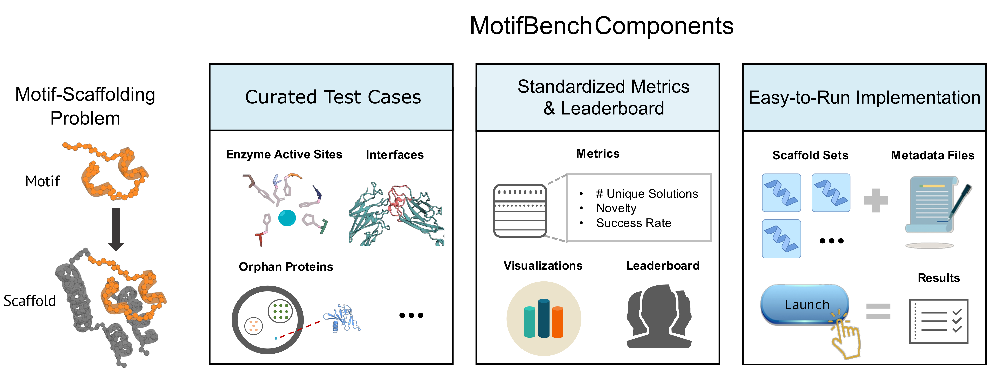

# MotifBench V0
<p align="center">
  
</p>  
MotifBench is a standardized protein design benchmark for motif-scaffolding problems.
The motif-scaffolding problem is a central task in computational protein design:
Given the coordinates of atoms in a geometry chosen to confer a desired biochemical function (a motif), the goal is to identify diverse protein structures (scaffolds) that include the motif and stabilize its geometry.


MotifBench is introduced in a [whitepaper](PAPER_LINK_WHEN_READY).
In this companion repository we provide:
* [A collection of motif test cases](#test-cases)
* [Evaluation instructions with an example](#evaluation)
* [A performance leaderboard (with submission instructions)](#leaderboard)
* [Acknowledgements](#acknowledgement)

# Test-Cases

MotifBench V0 includes 30 test problems that are specified in `./test_cases.csv`, and through the pdb files in `./motif_pdbs/`.
In this csv, each row defines a test case, with the following columns characterize the problems:
* `pdb_id` The Protein Data Bank identifier of the experimentally characterized structure from which the motif extracted.
* `motif_residues` The chain ID and indices of residues that comprise the motif.  Discontiguous residue ranges are separated by semicolons.
* `redesign_idcs` The indices of residues within motif segments for which the amino acid type is not constrained to match its identity in the reference protein, and will be "redesigned" during inverse-folding.  This column is included because in cases where side-chain atoms are not involved in protein function, the motif-scaffolding problem may be made easier by allowing alternative amino acid types to be chosen for these positions during fixed-backbone sequence design.
* `length` The number of residues required in each scaffold.
* `group` The problem group into which the motif is assigned.  This grouping is defined based on the number of contiguous segments that comprise the motif: group 1 motifs have only one segment, group 2 motifs have 2 segments, and group 3 motifs have 3 or more segments.

### Motif pdb files in `./motif_pdbs/`
We provide a PDB file for each benchmark problems in [./motif_pdbs/](./motif_pdbs/) for use as input to motif scaffolding methods.
These files have been constructed programmatically using `./scripts/download_and_format_motifs.py`, which reads the motif problem specifications in [./test_cases.csv](./test_cases.csv), downloads associated experimental structures from [rcsb.org](https://www.rcsb.org/), and parses out data for each motif.
In these files:
* Each segment of the motif is labeled as its own chain (i.e. A, B, C, etc).
* For residues for which the amino acid type may be redesigned, all atoms other than N, CA, C, and O are removed and the residue type is set to unknown (`UNK`).  For residues for which the amino acid type may not be redesigned, side-chain heavy atoms.
* For convenience, metadata about each problem is also specified in the header of each motif pdb fie. It includes:
  *  `Reference PDB ID.` This is the idenitifier associated with the experimental structure from which the motif extracted.
  *  `Motif Segment Placement in Reference PDB.` This field may provide guidance for methods that require motif placement within designed scaffolds to be specified. However this aspect of a solution may also be chosen (even dynamically) in a problem-specific manner. For example, for problem 27 (4XOJ) this field is `38;A;43;B;90;C;46`. This obtains because 4XOJ has 223 resolved residues (indexed as 16 through 238), the 38 corresponds to the 38 residues (16-54) before residue 55 (segment A), the 43 corresponds to the residues between residue 55 and 99 and so on. The final 46 indicates that the native structure terminates with 46 additional residues that are not part of the motif.
  * `Length for Designed Scaffolds.` This again is copied from the `test_cases.csv` specification that dictates the required length of scaffolds.


# Evaluation

Evaluating the benchmark requires several steps, described below.
We provide examples of compatible inputs, example evaluation outputs, and result summaries for download from [Zenodo](https://zenodo.org/) at [zenodo.org/records/14731790](https://zenodo.org/records/14731790).
This demonstration uses scaffolds generated with [RosettaFold Diffusion](https://github.com/RosettaCommons/RFdiffusion);
we provide details and scripts used to create this example [here](./example/readme.md) for replicablility.

### Prepare backbone directory structure and metadata

For each benchmark problem, create a directory with 100 designed scaffolds as PDB files and a metadata csv file.
* Each scaffold should follow the naming format `{test_case}_{sample_number}.pdb`, where `{test_case}` is the concatenation of the problem number and the PDB ID (e.g. `01_1LDB`) and  `sample_number` is zero-indexed (e.g. `01_1LDB_0.pdb, 01_1LDB_1.pdb,...,01_1LDB_99.pdb`).
* The metadata file must be named `scaffold_info.csv` and contain two columns:
  * `sample_num`: The sample number for each backbone. This should be range from $0$ to $99$. 
  * `motif_placements`: The order of multiple motif segments in backbones. For example, for a motif with 3 segments (chains `A` and `B` in the motif_pdb file) the string `12/B/15/A/29` indicates that the full backbone chain comprises 12 residues of scaffold, then the residues of motif segment B, then another 15 residues of scaffold, then the residues of motif segment A, and finally another 29 residues of scaffold.  If placement is such that the backbone begins (respectively _ends_) with a motif segment the motif_placements string starts with the motif chain for example as `B/15/A/29` (respectively `12/B/15/A`).

The organize the scaffold and metadata files as below:
```bash
scaffolds/
├── {case_1} # Name of tested case, e.g. "01_1LDB"
│   ├── scaffold_info.csv # File storing motif placements for each scaffold, see example for more details
│   ├── {case_1}_1.pdb
│   ├── {case_1}_2.pdb
│   ├── ......
│   └── {case_1}_100.pdb
├── {case_2}
│   ├── scaffold_info.csv
│   ├── {case_2}_1.pdb
│   ├── {case_2}_2.pdb
│   ├── ......
│   └── {case_2}_100.pdb
├── ......
└── {case_30} # 30 case in total for MotifBench V1.0
    ├── scaffold_info.csv
    ├── {case_30}_1.pdb
    ├── {case_30}_2.pdb
    ├── ......
    └── {case_30}_100.pdb
```
Find an example obeying these conventions in `scaffolds.zip` at [zenodo.org/records/14731790](https://zenodo.org/records/14731790).

### Install required packages and Foldseek database
To evaluation benchmark peformance on scaffolds assembled as described above, first download the repo and install necessary requirements.
```
# Clone the benchmark repo and install 
git clone git@github.com:blt2114/motif_scaffolding_benchmark.git
cd motif_scaffolding_benchmark

# Create and activate environment
conda env create -f motif_bench.yml
conda activate motif_bench
```

The workhorse benchmarking evaluation steps are implemented in [Scaffold-Lab](https://github.com/Immortals-33/Scaffold-Lab).
```
# Install Scaffold-lab into your conda environment
pip install -e Scaffold-Lab
```

For novelty evaluation, the Foldseek PDB database is required.
```
foldseek_pdb_database_path=<desired_path_for_foldseek_database>
mkdir $foldseek_pdb_database_path
cd $foldseek_pdb_database_path
foldseek databases PDB pdb tmp
```

### Run the benchmark and compile result summaries
Next, several paths must be specified in a configuration file [config.txt](config.txt), which will given as an input to the evaluation script.
```
# Paths configuration
scaffold_base_dir=<path/to/scaffolds> # Directory with your scaffolds to benchmark, organized as above
benchmark_dir=<path/to/motif_scaffolding_benchmark> # Location of this code repository
foldseek_db_path=</path/to/foldseek/pdb_database/pdb> # Same as $foldseek_pdb_database_path above
base_output_dir=</path/to/eval_results_dir> # Location to write evaluation results
python_path=</path/to/conda/env/python> # Location of python executable
```

As a demonstration you can download and run the benchmark evaluation of RFdiffusion scaffolds by downloading our example case:
```
# In the benchmark repository directory, download example scaffolds from zenodo
wget https://zenodo.org/records/14396944/files/scaffolds.zip
unzip scaffolds.zip

# Write paths to config.txt
echo scaffold_base_dir=`pwd`/scaffolds > config.txt
echo benchmark_dir=`pwd` >> config.txt
echo foldseek_db_path=$foldseek_pdb_database_path >> config.txt
echo base_output_dir=`pwd`/evaluation >> config.txt
echo python_path=`which python` >> config.txt # With conda environment activated
```

Run the evaluation script from the benchmark repository directory.
This step requires about one GPU-day.
```
# Run the evaluation for each problem in sequence on one machine / GPU
ls motif_pdbs/ | sed 's/\.pdb$//' | while read motif; do
    ./scripts/evaluate_bbs.sh $motif config.txt
done

# Or run on the whole set of scaffolds in parallel on a Slurm cluster
./scripts/launch_all.sh config.txt
```

Finally, compile results as:
```
./scripts/summarize_results.sh config.txt
```
Summary results are written to the <base_output_dir> specified in your config file both by problem (`summary_by_problem.csv`) and by group (`summary_by_group.csv`).
Example summary files are provided on Zenodo.

For example, for the RFdiffusion example, we can view results by group as:
```
> wget https://zenodo.org/records/14396944/files/evaluation_summaries.zip
> unzip evaluation_summaries.zip
> cat evaluation_summaries/summary_by_group.csv | column -s, -t 
Group  Number_Solved  Mean_Num_Solutions  Mean_Novelty  Mean_Success_rate
1      6              11.40               0.19          27.30
2      6              0.80                0.20          19.90
3      1              0.40                0.07          2.00
```


# MofifBench V0 Leaderboard


| Entry Name     | MotifBench Score | Date (month/year)   | Contact Name | Contact Email               | Reported compute time         | Result files                                | Further details link |
| -------------- | ---------------- | ------------------- | ------------ | --------------------------- | ---------------------         | --------------------                        | -------------------- |
| RFdiffusion    | 28.60            | 02/2025             | Brian Trippe | btrippe@stanford.edu        | 31 GPU hours (various models) | [link](https://zenodo.org/records/14731790) | [link](https://github.com/blt2114/MotifBench/tree/main/example#readme) |


### Instructions for having your results added to the leaderboard
Results of motif-scaffolding methods will be shared on the github repository upon request.
To have the results of your method posted, post an issue to the github and include:
 1. Your success rate summary produced by `./scripts/collect_summaries.sh`
 1. A __permanent__ download link including (1) your submitted scaffold set, (2) the full evaluation results, and (3) summary results as produced by `./scripts/summarize_results.sh`.  We recommend using [Zenodo](https://zenodo.org/) or [Open Science Framework](https://osf.io/) for saving these results.
 1. A description of the how the scaffolds were generated.  This could be a link to an arXiv paper or github repository, or an explanation of how an existing approach (e.g. with what default or non-default settings).
 1. A description of the compute resources used to generating backbones (e.g. "about 50 GPU hours across a variety of node types on a university cluster")
 1. A contact name and email address to be posted with your results.
We will do our best to update this page with your results within a week.


# Acknowledgement
This repository builds heavily on several existing codebases:
* [Scaffold-Lab](https://github.com/Immortals-33/Scaffold-Lab) houses the evaluation pipeline.
* [ProteinMPNN](https://github.com/dauparas/ProteinMPNN) is used for fixed backbone sequence design.
* [ESMFold](https://github.com/facebookresearch/esm) is used for protein structure prediction.
* [Foldseek](https://github.com/steineggerlab/foldseek) is used for structural clustering and novelty evaluation.
If you use the scripts herein in published research, please consider crediting these resources.
